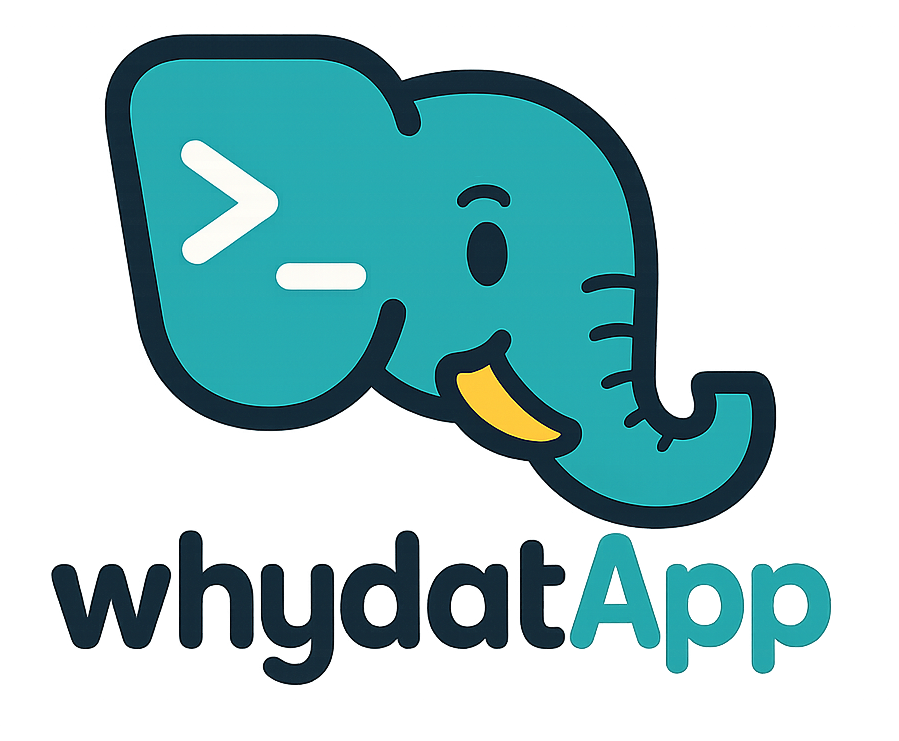

<p align="center">
  <picture>
    <source media="(prefers-color-scheme: dark)" srcset="docs/assets/whydatapp-dark.png">
    
  </picture>
</p>

# whydatApp (`why?`)

Track *why* you installed every tool on your machine.

`why?` watches for installs (`brew install`, `npm i -g`, `pip install`, `cargo install`, `git clone`, …) via a tiny shell hook, and asks five quick questions: name, what it does, project, why, and what to do with it (document, add to setup script, experimental, remove later, ignore). Local-only SQLite. Local web UI for search, sort, and sharing. Privacy-focused — nothing leaves your machine.

## Install

> Not yet on PyPI. The current path is install-from-source. PyPI publication is on the roadmap.

```bash
git clone https://github.com/Nostoi/whydatapp.git
cd whydatapp
uv tool install --from . 'why-cli[web]'   # or: pipx install '.[web]'
why init                                   # interactive setup; edits your shell rc
```

Restart your shell, then try `brew install ripgrep` (or any tracked manager).

Full install instructions, including building from a wheel: **[docs/guide/install.md](docs/guide/install.md)**.

## Quick reference

| Command           | What it does                                   |
|-------------------|------------------------------------------------|
| `why init`        | Interactive first-run setup                    |
| `why log -- <cmd>`| Manually log an install                        |
| `why review`      | Drain the skipped/incomplete review queue      |
| `why list`        | Print installs as a table                      |
| `why export`      | Export to Markdown or JSON                     |
| `why serve`       | Open the local web UI at `127.0.0.1:7873`      |
| `why uninstall`   | Remove the hook (and optionally the data)      |

Detailed usage with examples: **[docs/guide/usage.md](docs/guide/usage.md)**.

## Documentation

- **[Install](docs/guide/install.md)** — Requirements, install paths (source / wheel / future PyPI), what `why init` does, uninstall.
- **[Usage](docs/guide/usage.md)** — Every CLI subcommand with examples.
- **[Web UI](docs/guide/web-ui.md)** — Walkthrough of the local web interface.
- **[Configuration](docs/guide/configuration.md)** — `~/.why/*.toml` files, env vars, ignore rules.
- **[Troubleshooting](docs/guide/troubleshooting.md)** — Hook not firing, prompt missed, address-in-use, restoring data, filing bugs.
- **[Development](docs/guide/development.md)** — Clone, set up, run tests, build the wheel, project layout, contribute.
- **[Design spec](docs/superpowers/specs/2026-04-29-whydatapp-design.md)** — Architecture, data model, decisions, post-MVP roadmap.

## Privacy

- All data lives in `~/.why/data.db`. No network calls.
- The web UI binds to `127.0.0.1` only.
- All static assets vendored locally — no CDN, no Google Fonts, no analytics.
- The shell hook ignores any install triggered by another tracked installer (no false positives from `brew` resolving deps).

## Status

1.0 MVP. Sync, auth, AI enrichment, source scraping, and one-click remote install are on the roadmap. See [docs/guide/development.md](docs/guide/development.md#roadmap) for the priority order.

## License

TBD.
